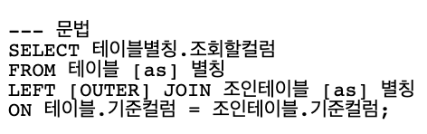

## Code Hightlight 버그...

- 코드를 블록으로 감싸고 Code Hightlight를 해주기 위해 <span>```SQL</span>과 같이 작성했습니다.

- 그 결과



- 이처럼 Code Highlight가 적용되지 않았습니다.

## 해결법

- 해결방법은 간단합니다.
- <span>```sql</span>과 같이 `소문자`로 작성해야합니다.

- 결과는??


## 결론

- Code Hightlight를 하고 싶으면 소문자로 작성합니다.